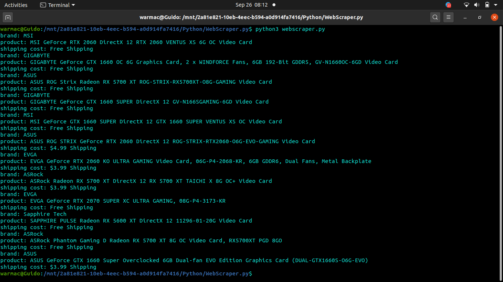
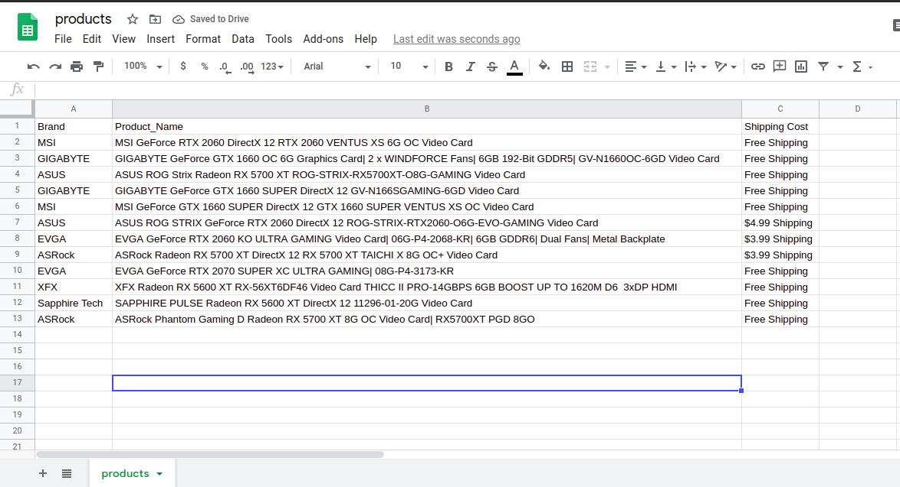

<h1>WebScrapper.py</h1>
 
WebScrapper.py is a webscrapper based on python.

---
# Working

- surfs a website known as newegg for graphics cards and video devices
- returns the make of the graphic card, it's name and it'ss shipping cost 
- stores the data in a .csv file 

